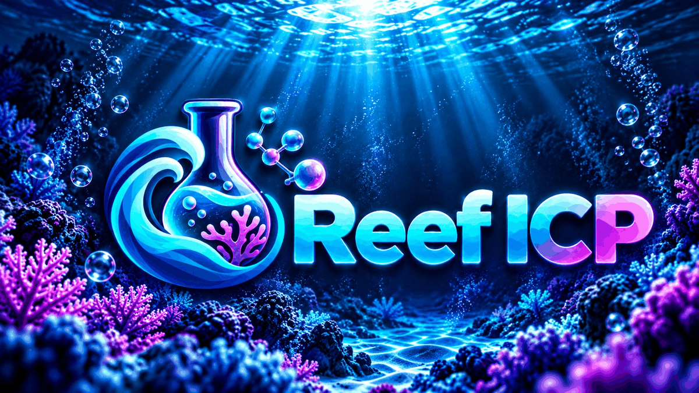
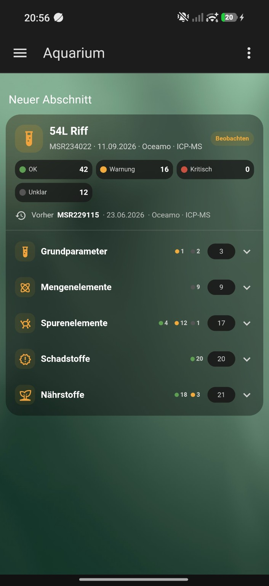
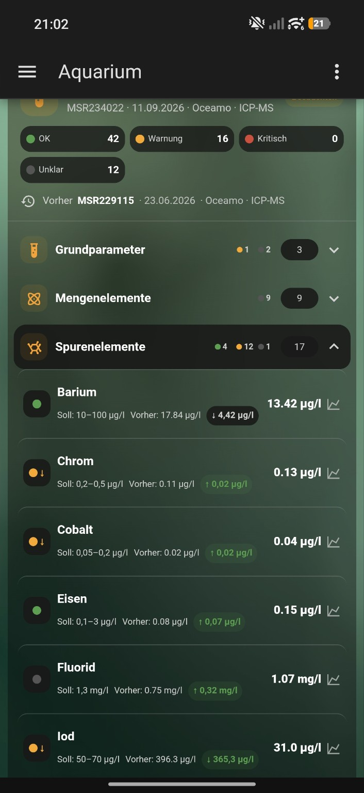
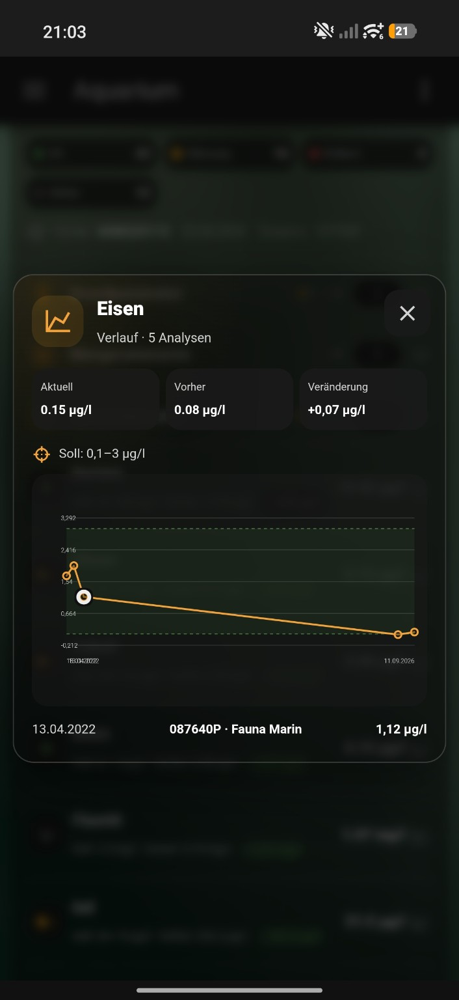
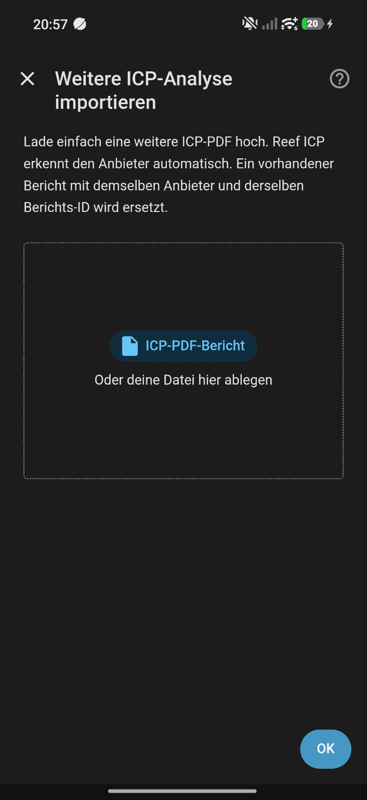
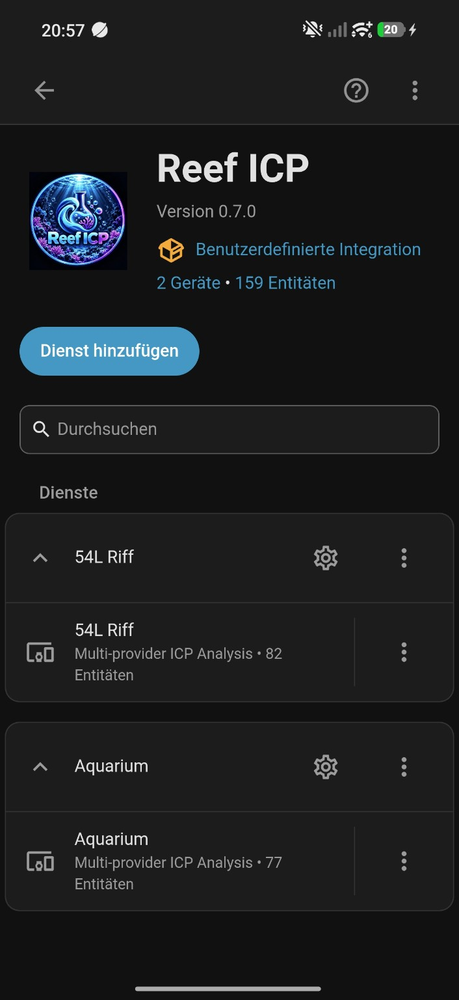

<p align="center">
  
</p>

# Reef ICP for Home Assistant

A custom Home Assistant integration for importing reef-aquarium ICP analysis reports from multiple laboratory providers.

> **Status:** Early development / beta testing.

## Screenshots

Reef ICP turns uploaded laboratory reports into a provider-independent Home Assistant view with current values, status information and long-term history.

<p align="center">
  
</p>

<p align="center">
  <strong>Dashboard overview</strong><br>
  Current report, provider/report type, status counts, previous analysis and measurement categories at a glance.
</p>

<table>
  <tr>
    <td align="center"><strong>Measurements & comparison</strong></td>
    <td align="center"><strong>Cross-provider history</strong></td>
  </tr>
  <tr>
    <td align="center">
      
    </td>
    <td align="center">
      
    </td>
  </tr>
  <tr>
    <td align="center">
      Target ranges, previous values, changes and trend indicators.
    </td>
    <td align="center">
      Comparable values from different laboratories share one history. The selected point shown here originates from Fauna Marin.
    </td>
  </tr>
</table>

<table>
  <tr>
    <td align="center"><strong>PDF import</strong></td>
    <td align="center"><strong>Home Assistant integration</strong></td>
  </tr>
  <tr>
    <td align="center">
      
    </td>
    <td align="center">
      
    </td>
  </tr>
  <tr>
    <td align="center">
      Upload a report. Reef ICP detects the supported laboratory automatically.
    </td>
    <td align="center">
      Imported analytes are exposed as normal Home Assistant entities and long-term statistics.
    </td>
  </tr>
</table>

> Screenshots show a development installation containing test reports from multiple supported laboratories and report types.

## Supported providers

### Oceamo

- Classic Oceamo ICP PDF format
- Oceamo **Reef ICP-MS** / ICP-MS analysis-report format
- Automatic distinction between classic reports (`classic_icp`) and ICP-MS reports (`reef_icp_ms`)
- German classic and English ICP-MS headings / metadata
- Cross-report normalization of English ICP-MS names such as `Boron`, `Potassium`, `Sodium`, `Iodine`, `Copper` and `Tungsten` to the existing Reef ICP analytes
- ICP-MS-only / extended parameters such as SAK/SAC254, Cäsium, Cer, Gallium, Ruthenium, Thorium, Tellur, Neodym and Hafnium when present in the supplied report
- Report metadata and sample timestamp
- Measurements and target values
- Oceamo rating artwork from both classic and current ICP-MS layouts, including multiple icon sizes, with conservative range/limit fallback when artwork cannot be classified
- `n.n.` and `n.b.` without converting them to zero
- Interpretation and product recommendation text when present

The ICP-MS parser is designed around Oceamo's publicly documented current parameter set and public English-format analysis-report examples, including the `MSR...` report family. Public reports **MSR229115** and **MSR234022** were used as format/value references for this development step.

### Fauna Marin

- Tested Fauna Marin Reef ICP one-page PDF format
- Sample ID, sample date, received date, aquarium volume and sample location
- Macro elements, nutrients, trace elements and potential pollutants
- Reference ranges
- `n.n.` and `n.g.`
- Per-parameter Elementals dosage recommendations
- Water-change recommendations
- Unit normalization for comparable cross-provider history

The Fauna Marin parser has been tested against four real reports from 2022.

### ATI

- Current ATI laboratory PDF layout
- Automatic recognition using ATI-specific PDF fingerprints
- Analysis ID, barcode, aquarium name, volume, reason and laboratory dates
- Basis values, major elements, trace elements, nutrients and pollutants
- ATI ideal values and textual laboratory assessments
- ATI `---` non-detect values are preserved as non-numeric results
- ATI `TOP`, `WENIG`, `ERHÖHT`, `ZU HOCH`, `Achtung` and `Kritisch` assessments are normalized to Reef ICP status levels
- Comparable concentrations are normalized to the shared cross-provider units
- Recommended-action and dosing text is preserved for later card display

The ATI parser has been developed against a real public current-format ATI report from 2026 (analysis ID **372482**). Older ATI layouts and the newer Pro / Ultimate-MS variants remain separate compatibility targets until representative PDFs are available.

### TRITON

- Tested legacy TRITON ICP-OES PDF table formats from **2014 and 2015**
- Automatic recognition of both tested legacy dosing-header variants
- 32 analytes in the 2014 report and 33 analytes in the 2015 report
- Set points, deviations and aquarium volume
- Reads the green / yellow / red **Warnampel** directly from the PDF drawing stream
- Preserves legacy TRITON dosing recommendations per analyte
- Supports both `Einmalige / Tägliche Dosierung` and `Korrektur / Erhaltungs Dosierung` layouts
- Normalizes comparable analytes into the shared Reef ICP history
- Uses the printed TRITON report ID when present (for example `296B`); otherwise generates a stable provider-local ID
- Uses a trustworthy date from the report itself when available
- Can fall back to a parsed sample date or a plausible date embedded in the PDF filename
- Deliberately ignores PDF `CreationDate` metadata because it can represent the export time rather than the laboratory analysis date
- If no trustworthy date remains, the Home Assistant import flow asks for the analysis date instead of rejecting the PDF

The currently supported TRITON family is explicitly treated as `triton_legacy_icp`. It has been tested against two real two-page German TRITON ICP-OES reports from 2014 and 2015. Current TRITON reports may use a different layout and remain a separate compatibility target until a representative modern result is available.

## Provider and report type

Reef ICP stores the laboratory provider separately from a report-type hint. This prepares the integration for different analysis products from the same laboratory, for example classic Oceamo ICP versus **Oceamo Reef ICP-MS**, without treating them as different providers.

Current report-type hints include `classic_icp`, `reef_icp_ms`, `reef_icp`, `ati_icp` and `triton_legacy_icp`. Future parsers can add further types such as ATI Ultimate-MS while keeping the same provider-neutral history model.

## Aquarium profile

Reef ICP separates the aquarium itself from the laboratory that performs an ICP.

Each aquarium can now store:

- **Net water volume** in liters
- **Dosing / supply system**, independent of the ICP laboratory

Built-in presets currently include **Fauna Marin Balling Light**, **ATI Essentials pro**, **TRITON Method** and **Oceamo DUO**. The selector also accepts a custom system name, and an aquarium can be set to analysis-only mode.

These settings remain attached to the aquarium when additional reports from Oceamo, Fauna Marin, ATI, TRITON or future providers are imported. Existing aquariums can edit the profile through **Configure → Aquarium settings**.

This is the foundation for a provider-independent recommendation engine: laboratory measurements stay normalized by Reef ICP, while dosing recommendations can be generated for the aquarium's chosen supply system and net water volume rather than blindly copying the laboratory's product recommendations.

## Supply-system recommendations

Reef ICP keeps the laboratory interpretation separate from the aquarium's own supply system. The ICP provider can therefore change while recommendations continue to follow the products actually used on the aquarium.

Starting with version `0.10.0`, the recommendation engine supports:

- **Fauna Marin Balling Light** core corrections plus a broad set of **Fauna Marin Elementals / Elementals Trace** single-element corrections, including Elementals Trace Se for selenium.
- **ATI Essentials pro** with **ATI ICP Elements** for provider-independent correction of major, minor and trace-element deficiencies.
- **Oceamo DUO** with numeric DUO-KH correction plus **Oceamo Single Elements** for supported individual deficiencies.
- **TRITON Method / Core7 Flex** as an official-calculator workflow. Reef ICP identifies the deficient TRITON single element and links to TRITON's own calculator instead of copying an unpublished product concentration.

Examples of automatically calculated single-element corrections include iodine, fluoride, molybdenum, manganese, lithium, potassium, boron, strontium and additional supported analytes depending on the selected supply system.

The calculation uses:

1. the aquarium's stored **net water volume**,
2. the normalized current ICP value,
3. the target value/range in the imported report, and
4. the published manufacturer strength of the selected product.

When the manufacturer publishes a maximum daily increase, Reef ICP also calculates a minimum number of dosing days and an approximate amount per day. If no official daily limit is available in the implemented source data, the card deliberately shows only the total correction and warns against interpreting it as an automatic one-time dose.

Calculated amounts are **correction doses**, not permanent daily maintenance doses. Balling Light, ATI Essentials pro, Oceamo DUO and TRITON Core7 remain consumption-driven systems for ongoing daily dosing.

Manufacturer formulations can change. Reef ICP therefore surfaces the manufacturer source used for each recommendation and users should confirm the current product label before dosing.

For **Fauna Marin Elementals Trace Se**, Reef ICP uses the published strength of **1 ml per 100 l for +0.5 µg/l selenium** and Fauna Marin's published maximum daily increase of **+1 µg/l**.

### ICP-MS-only corrections

Some ultra-trace corrections require a sufficiently sensitive analytical method. Reef ICP can enforce that requirement per product rule instead of calculating from an unsuitable report.

For **Oceamo Single Elements Selen**, Reef ICP uses Oceamo's published strength of **1 ml per 100 l for +0.05 µg/l** and maximum daily increase of **+0.05 µg/l**, but only calculates an upward correction from an **Oceamo Reef ICP-MS** report (`reef_icp_ms`). Oceamo states that the recommended selenium range is below the reliable detection limit of ICP-OES. A low selenium result from another report type therefore shows an ICP-MS requirement instead of a dose.

## Multi-provider history

Reports from different providers can be stored in the same aquarium.

Comparable analytes are normalized to the same internal key, category and unit. This allows a history such as:

```text
Fauna Marin → Fauna Marin → Oceamo → Oceamo ICP-MS
```

to appear in one Home Assistant long-term statistic and in the bundled history chart.

Examples of normalization:

- Fauna Marin iodine: `mg/l` → `µg/l`
- Fauna Marin ICP phosphorus: `mg/l` → `µg/l`
- Fauna Marin silicon: `mg/l` → `µg/l`
- Fauna Marin `Brom` is normalized to the shared `Bromid` analyte

Measurements that are not directly comparable remain separate. For example, Fauna Marin elemental sulfur is not merged with Oceamo sulfate.

## Importing another ICP

Open **Settings → Devices & services → Reef ICP → Configure → Import another ICP analysis** and upload the ICP PDF.

**Reef ICP detects the laboratory automatically.** After upload, a confirmation step shows the detected provider plus the report type, analysis ID and date when available. You can confirm the result or select another supported provider before the report is stored.

The selected provider parser validates the PDF again. A manual override therefore does not force an incompatible report into the wrong parser: if the PDF does not match the selected laboratory, the import stops with an error.

Currently detected automatically:

- Oceamo
- Fauna Marin
- ATI
- TRITON (tested legacy ICP-OES format)

If no supported provider can be identified, the import stops instead of guessing. Date handling is provider-independent: Reef ICP first uses a date parsed from the report, then a parsed sample date or a plausible filename date. PDF `CreationDate` metadata is not treated as an analysis date. If no trustworthy date remains, Reef ICP opens a second step with a native Home Assistant date selector. A report is replaced only when both its provider and provider report ID match an already stored report.

## Analysis date handling

Reef ICP applies the same date rules to every supported laboratory:

1. Use the provider-specific analysis/report date when it is present in the PDF.
2. If the report has no separate analysis date but does contain a parsed sample timestamp, use that sample date as the chronological report date.
3. Otherwise, use a plausible calendar date embedded in the original PDF filename.
4. If none of those sources is available, Home Assistant asks you to select the date manually.

PDF `CreationDate` metadata is deliberately ignored. It describes when a PDF file was created or exported and is not guaranteed to match the laboratory analysis or sampling date.

A manually selected date is stored with `analysis_date_source: manual`.

## What it currently does

- Install as a HACS custom repository
- Add **Reef ICP** under **Settings → Devices & services**
- Create an aquarium profile with net water volume and a persistent dosing/supply system
- Import ICP PDFs directly in Home Assistant
- Confirm or override the automatically detected ICP provider before a report is stored
- Store up to 100 reports per aquarium
- Keep reports in chronological sample order
- Keep the newest report as the current sensor state
- Keep one stable sensor per analyte seen in any stored report
- Preserve the newest available analyte result when a later provider omits that parameter
- Create `ICP Status`, `Analysis date` and `Analysis number` sensors
- Preserve non-numeric laboratory states instead of converting them to zero
- Import historic numeric values as Home Assistant external long-term statistics
- Compare the newest ICP with the immediately previous stored ICP
- Combine comparable values from different providers in the same history
- Bundle and automatically load the **Reef ICP Card**
- Open an interactive history chart by tapping a measurement
- Show the provider for the current report, previous report and selected history points
- Label Oceamo ICP-MS reports as `Oceamo · ICP-MS` in the dashboard/history source display

## Current entities

For each aquarium, the integration creates:

- `ICP Status`
- `Analysis date`
- `Analysis number`
- one stable sensor for every analyte that has appeared in any stored report

`ICP Status` contains the complete normalized measurement list, provider metadata, previous-analysis comparison, stored-report summary and statistic IDs used by the bundled card.

### Stable measurement entities across providers

Different laboratories do not always test the same parameter set. Starting with version `0.6.1`, individual measurement entities therefore remain stable across provider changes.

If the newest ICP omits an analyte entirely, the sensor keeps the newest available result from the most recent older report that actually contained that analyte. The sensor exposes `included_in_current_report: false` plus `last_measured_*` and `current_*` attributes so the source of the value remains explicit.

This fallback only applies when the parameter is absent from the newest report. If the newest report contains the analyte but reports `n.n.`, `n.b.`, `n.g.` or ATI `---`, that laboratory result remains current and Reef ICP does not substitute an older numeric value.

The `ICP Status` entity and Reef ICP dashboard card continue to show only measurements that are actually present in the newest report. Carried-forward values therefore never appear as fresh measurements in the main ICP card.

## Fauna Marin recommendations

Where present in the PDF, Fauna Marin measurement attributes can contain a structured recommendation.

Example dosage:

```yaml
recommendation:
  type: dose
  amount_ml: 2.7
  days: 2
  product: Elementals Trace I
```

Example water-change recommendation:

```yaml
recommendation:
  type: water_change
  product: Elementals Trace Ba
```

These are imported as laboratory-provided recommendations. Reef ICP does not currently control dosing equipment.

## Laboratory recommendations in the dashboard card

Reef ICP keeps laboratory instructions visually separate from its own supply-system calculations.

When the imported PDF contains recommendation data, the card adds a collapsed **Recommendations from the laboratory report** panel below the measurements. Depending on the laboratory format, it can show:

- Fauna Marin row-level dosage recommendations with the analyte, amount, duration and named Elementals product
- Fauna Marin water-change recommendations and the product named in the report
- legacy TRITON correction/one-time and maintenance/daily dosing values, including the report aquarium volume when available
- Oceamo or ATI report-level product recommendation text when the PDF contains such a section

These values are displayed as imported laboratory information. Reef ICP does not recalculate them. The separate **Recommendations for your supply system** panel remains the provider-independent Reef ICP calculation based on the aquarium's stored net volume and selected dosing system.

For the frontend, Reef ICP also exposes a dedicated `laboratory_recommendations` payload on the `ICP Status` sensor. This keeps laboratory-provided instructions separate from the generic measurement list and from Reef ICP's own supply-system calculations.

## Status handling

Oceamo status levels come directly from the rating artwork embedded in the report. Reef ICP recognizes the tested classic and current ICP-MS icon variants by Oceamo's green / yellow / red status colors and arrow direction, while retaining exact known classic icon hashes as a compatibility path.

ATI's current PDF contains textual assessments. Reef ICP maps ATI labels such as `TOP`, `WENIG`, `ERHÖHT`, `ZU HOCH`, `Achtung` and `Kritisch` into the same `ok` / `warning` / `critical` model while preserving the laboratory result itself.

The tested Fauna Marin format does not contain equivalent Oceamo-style severity icons. Reef ICP therefore derives a conservative display status from Fauna Marin's published reference range:

- inside reference range → `ok`
- outside reference range → `warning`
- insufficient information → `unknown`

Fauna Marin values are not automatically labeled `critical`.

## Historical values

Numeric measurements from all stored reports are imported as Home Assistant external long-term statistics.

The original sample timestamp is used when available. Date-only samples are placed at local noon, then rounded to the full hour as required by Home Assistant external statistics.

Provider parsers normalize comparable measurements before statistics are imported. A safety check prevents points with mismatching units from being merged into the same statistic.

`n.n.`, `n.b.`, `n.g.` and ATI `---` non-detect results are never converted to numeric zero.

## Reef ICP dashboard card

The bundled card is registered internally as:

```yaml
type: custom:reef-icp-card
```

Reef ICP uses the Reef ICP namespace throughout the integration, dashboard card and Home Assistant domain.

In the Home Assistant card picker it appears as **Reef ICP Card**.

The card shows:

- aquarium name
- provider and report type
- latest analysis/report ID and date
- overall status and status counts
- previous analysis and provider
- collapsible categories
- current measurement
- target / reference range
- previous measurement
- change and trend direction
- history availability
- interactive long-term history
- provider, report type and report ID for selected history points

## Project namespace

The Home Assistant integration domain is:

```text
reef_icp
```

Reef ICP uses this namespace for config entries, entities, external statistics and dashboard resources.

The repository URL is:

```text
https://github.com/shdtfy/ha-reef-icp
```

Version `0.11.0` completed the project-wide namespace rename. Existing test installations that used the previous internal namespace should be removed and installed again.

## Installation during development

1. Open HACS.
2. Add this repository as a custom **Integration** repository:
   `https://github.com/shdtfy/ha-reef-icp`
3. Install **Reef ICP**.
4. Restart Home Assistant.
5. Go to **Settings → Devices & services → Add integration**.
6. Search for **Reef ICP**.
7. Enter an aquarium name and upload the first ICP PDF. Reef ICP detects the provider automatically.

## Roadmap

- [x] Classic Oceamo PDF parser
- [x] Oceamo status artwork extraction
- [x] Fauna Marin Reef ICP PDF parser
- [x] Current ATI laboratory PDF parser
- [x] Automatic provider detection during import
- [x] Provider confirmation and manual override with parser re-validation
- [x] Cross-provider normalized history
- [x] Long-term statistics
- [x] Previous-ICP comparison
- [x] Bundled dashboard card
- [x] Interactive measurement history
- [x] Stable measurement entities when providers omit analytes
- [x] Reef ICP project branding
- [x] README screenshots
- [x] Show laboratory interpretation / evaluation text inside the card when present
- [x] Show laboratory dosing recommendations inside the card
- [ ] Older ATI layouts and ATI Pro / Ultimate-MS variants
- [x] Oceamo Reef ICP-MS / current ICP-MS report layout
- [x] TRITON legacy ICP-OES (tested 2014 + 2015 layouts)
- [x] Provider-independent analysis-date fallback with manual Home Assistant date selector
- [ ] Current TRITON ICP-OES report layout
- [ ] Reef Factory Smart ICP-OES
- [ ] Additional newer Oceamo report variants if the PDF layout changes
- [ ] Additional ICP laboratories
- [ ] Parser regression tests in the repository
- [ ] First tagged HACS release
- [ ] Optional dosing assistant with explicit safeguards and user approval

## Privacy

ICP reports can contain names, customer numbers and other personal information. Reports are processed locally by Home Assistant.

Private test reports are not included in the public repository.

## Disclaimer

Reef ICP is an independent community project and is not affiliated with or endorsed by Oceamo, Fauna Marin, ATI, TRITON or any other ICP laboratory.

Laboratory reference ranges and recommendations are imported from the supplied reports. Reef ICP does not replace professional aquarium husbandry advice.

---

<p align="center">
  Developed by <strong>Filo Mahlich</strong><br>
  Reef ICP is an independent open-source community project for Home Assistant.
</p>
