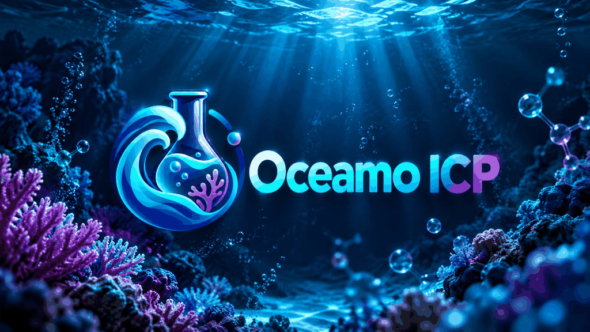

<p align="center">
  
</p>

# Oceamo ICP for Home Assistant

A custom Home Assistant integration for importing Oceamo ICP analysis reports directly from PDF files.

> **Status:** Early development / alpha.

## What it currently does

- Install as a HACS custom repository
- Add **Oceamo ICP** under **Settings → Devices & services**
- Upload an Oceamo PDF directly in the Home Assistant UI
- Parse report metadata, measurements, target values and Oceamo status icons
- Keep `n.n.` ("not detectable") and `n.b.` ("not determined") separate from numeric zero
- Create one Home Assistant sensor per ICP parameter
- Create dedicated sensors for the latest analysis date and analysis number
- Store multiple imported reports per aquarium
- Import additional PDFs from the integration's **Configure** / options flow
- Keep the newest report as the current sensor state
- Import historic numeric ICP values as Home Assistant external long-term statistics using the original sample timestamp
- Compare the newest ICP with the immediately previous stored ICP
- Bundle and automatically load a dedicated **Oceamo ICP Card** for Home Assistant dashboards
- Expose one `ICP Status` entity containing the complete latest report, status summary and comparison data for the custom card

The parser currently targets the classic Oceamo report format used by analysis **OC188727** from 2022. Support for newer Oceamo and ICP-MS report formats will be added separately.

## Installation during development

1. Open HACS.
2. Add this repository as a custom repository:
   `https://github.com/shdtfy/ha-oceamo-icp`
3. Select category **Integration**.
4. Install **Oceamo ICP**.
5. Restart Home Assistant.
6. Go to **Settings → Devices & services → Add integration**.
7. Search for **Oceamo ICP**.
8. Enter an aquarium name and upload an Oceamo PDF.

Additional analyses can later be imported through **Configure** on the integration entry.

## Current entities

For each aquarium, the integration creates:

- `ICP Status` – overall status plus the complete latest report and comparison data as attributes
- `Analysis date` – date of the latest imported analysis
- `Analysis number` – Oceamo analysis number of the latest imported report
- One sensor for each parameter in the latest report

Parameters from the RO/DI water check use their own unique IDs, so names such as copper or zinc can exist both for aquarium water and RO/DI water.

## Historical values

Numeric measurements from all stored reports are also imported into Home Assistant as external long-term statistics.

The original Oceamo sample timestamp is used as the basis for the historic point. Home Assistant requires external statistics to use hourly timestamps, so the timestamp is rounded down to the full hour for the statistics database.

Values such as `n.n.` and `n.b.` are never converted to `0`.

## Comparison with the previous ICP

When at least two reports are stored, every measurement from the newest report is matched to the same parameter in the immediately previous report.

The current measurement exposes attributes such as:

```yaml
has_previous: true
previous_value: 6.83
previous_raw_value: "6,83"
previous_display_value: "6,83 dKH"
previous_analysis_number: OC186791
previous_analysis_date: "2022-01-22"
previous_sample_taken: "2022-01-18T20:00:00"
delta: 3.94
trend: up
```

If either the current or previous value is non-numeric (`n.n.` / `n.b.`), `delta` and `trend` remain empty instead of inventing a numeric value.

The `ICP Status` entity contains the same enriched measurement data so the dashboard card can consume the complete analysis from a single entity.

## Oceamo ICP dashboard card

Version 0.3.0 adds the first bundled Lovelace card.

The card is served directly by the integration and automatically loaded by the Home Assistant frontend. No separate HACS frontend repository and no manual Lovelace resource entry are required.

After installing/updating the integration and restarting Home Assistant:

1. Open a dashboard.
2. Enter edit mode.
3. Add a card.
4. Search for **Oceamo ICP Card**.
5. Select the `ICP Status` sensor of the aquarium.

The card currently shows:

- aquarium name
- latest analysis number and date
- overall status
- green / yellow / red status counts
- previous analysis number and date
- collapsible Oceamo categories
- current measurement
- target value / target range
- previous measurement
- change and trend direction
- translated handling of `n.n.` and `n.b.`

Manual YAML configuration is also possible:

```yaml
type: custom:oceamo-icp-card
entity: sensor.my_aquarium_icp_status
show_previous: true
```

Optional custom title:

```yaml
type: custom:oceamo-icp-card
entity: sensor.my_aquarium_icp_status
title: Mein Riff
show_previous: true
```

## Roadmap

- [x] Classic Oceamo PDF parser
- [x] Oceamo status icon extraction for the tested classic report
- [x] Config flow with PDF upload
- [x] Sensor entities
- [x] Multiple stored reports
- [x] Long-term statistics using the original sample timestamp
- [x] Analysis number as a dedicated entity
- [x] Comparison with the previous stored ICP
- [x] First bundled Oceamo ICP dashboard card
- [ ] Card polish, richer history views and more display options
- [ ] Newer Oceamo / ICP-MS report formats
- [ ] Automated tests and release workflow
- [ ] First tagged HACS release

## Privacy

Oceamo reports can contain names, customer numbers and other personal information. Reports are processed locally by Home Assistant. Test reports containing personal information are **not** included in this repository.

## Disclaimer

This project is an independent community integration and is not affiliated with or endorsed by Oceamo.
